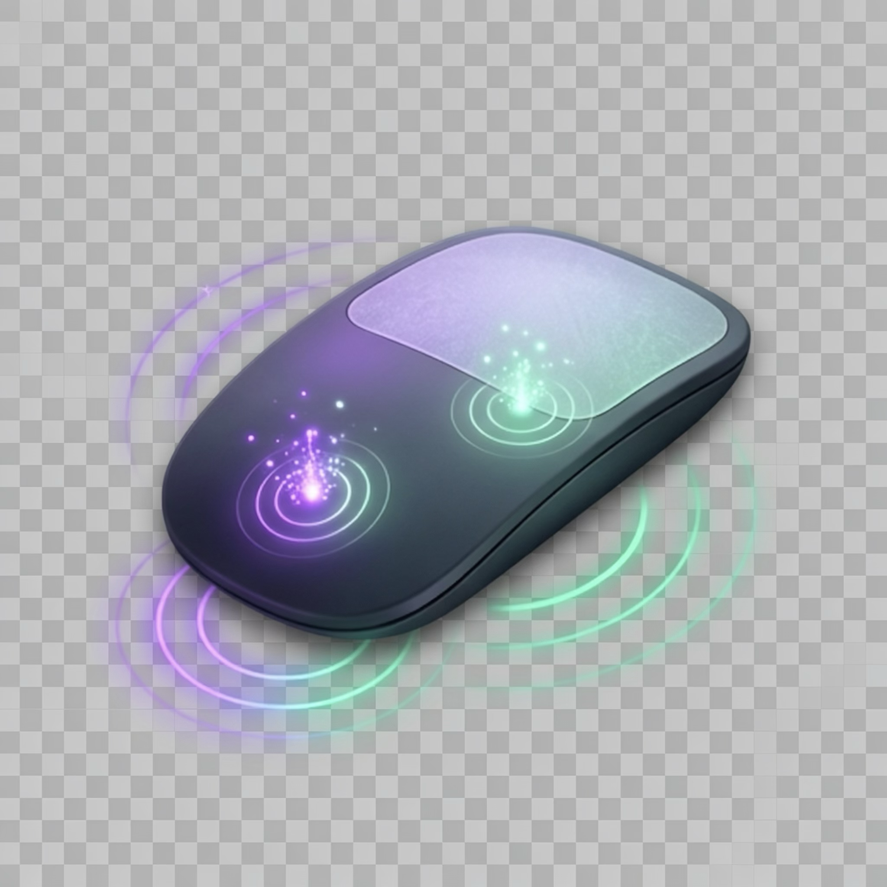

<div align="center">
  
  <h1>MagicTouch 🪄🖱️</h1>
  <p><strong>A native macOS menu bar utility for the Apple Magic Mouse that brings powerful, ultra-responsive custom multitouch gestures and action bindings to your workflow.</strong></p>

  <p>
    <a href="https://github.com/namikemen/magictouch/releases/latest"></a>
    
    
    
  </p>
</div>

---

## 📖 Overview

While macOS offers basic gesture settings for the Magic Mouse, power users often miss the advanced multi-finger productivity found on trackpads or specialized third-party tools. 

**MagicTouch** bridges directly into macOS's private `MultitouchSupport.framework` to intercept low-level touch frames with sub-millisecond latency. It features a custom gesture recognition state machine that accurately distinguishes between taps, swipes, pinches, tip-taps, multi-clicks, and physical surface clicks—without interfering with standard pointer tracking.

---

## ✨ Features

### 🖐️ Gesture Matrix

MagicTouch supports dozens of distinct gesture combinations across 1 to 4 fingers:

| Gesture Category | Supported Gestures | Description |
| :--- | :--- | :--- |
| **1-Finger** | `1-Finger Tap Left`, `1-Finger Tap Right` | Independent zones: tap left half vs right half |
| | `1-Finger Double Tap` (General, Left, Right) | Double tap anywhere or on a specific zone |
| | `1-Finger Triple Tap` (General, Left, Right) | Triple tap anywhere or on a specific zone |
| | `1-Finger Swipes` (Up, Down, Left, Right) | Directional surface flicks |
| | `1-Finger Click` | Physical mechanical click with 1 finger |
| **2-Finger** | `2-Finger Tap`, `Double Tap`, `Triple Tap` | Simultaneous multi-finger taps |
| | `Tip-Tap Left`, `Tip-Tap Right` | Rest one finger while tapping the other |
| | `2-Finger Pinch In`, `Pinch Out` | Live pairwise spread tracking for zoom gestures |
| | `2-Finger Swipes` (Up, Down, Left, Right) | Fast navigation / workspace switching |
| | `2-Finger Click` | Physical click with 2 fingers resting |
| **3-Finger** | `3-Finger Tap`, `Double Tap`, `Triple Tap` | 3-finger simultaneous contacts |
| | `3-Finger Click` | **Middle Click (Button 3)** by default |
| | `3-Finger Pinch In`, `Pinch Out` | Multi-finger zoom / exposê triggers |
| | `3-Finger Swipes` (Up, Down, Left, Right) | Space and app switching |
| **4-Finger** | `4-Finger Tap`, `4-Finger Click` | Broad multi-finger actions |
| | `4-Finger Swipes` (Up, Down, Left, Right) | Desktop & window manager controls |

---

### ⚡ Action Dispatcher Targets

Any gesture can be mapped to any of the following actions:

- **🖱️ Mouse Simulation**:
  - **Left Click** (Button 1)
  - **Right Click** (Button 2 / Secondary)
  - **Middle Click** (Button 3)
  - **Double Click** (Native Quartz click state sequence)
  - **Triple Click (Select Line)** (Universally highlights entire line/paragraph in macOS text editors, browsers, and terminals)
  - **Back / Forward** (Buttons 4 & 5)
- **⌨️ Keyboard Shortcuts**:
  - Interactive **Hotkey Recorder** that listens to actual physical keystrokes (`⌘`, `⌥`, `⌃`, `⇧` + key).
- **🖥️ System Controls**:
  - Mission Control, Application Exposé, Show Desktop, Launchpad, Volume Up / Down / Mute.
- **📜 Custom Scripting**:
  - **AppleScript**: Run arbitrary AppleScript code asynchronously.
  - **Shell Command**: Execute `/bin/zsh` scripts or CLI utilities in the background.

---

### 🎨 Visualizer & UI

- **Live Touch Visualizer**: A responsive SVG-based surface that maps real-time touch contact positions, contact radii, and timestamps directly inside the popover.
- **Menu Bar Utility**: Runs quietly in the status bar (`NSStatusItem`) with a custom mouse glyph.
- **Dynamic Configuration Store**: Saves user mappings to `~/Library/Application Support/MagicTouch/gestures.json` with live reload.

---

## 🛠️ Architecture

```
MagicTouch/
├── Sources/
│   ├── MultitouchBridge/          # C bridge to MultitouchSupport.framework
│   │   └── include/
│   │       ├── MultitouchBridge.h
│   │       └── module.modulemap
│   └── MagicTouch/
│       ├── Models/
│       │   └── GestureModel.swift # Gestures, Actions, MouseButtons, Enums
│       ├── Engine/
│       │   ├── MultitouchManager.swift # Device lifecycle & frame listener
│       │   ├── GestureRecognizer.swift # State machine (Taps, Swipes, Pinches, Tip-Taps)
│       │   ├── ActionDispatcher.swift  # CGEvent synthesis, AppleScript, Shell
│       │   └── PermissionManager.swift # Accessibility & Input Monitoring check
│       ├── Store/
│       │   ├── AppState.swift          # Live reactive state for visualizer
│       │   └── ConfigurationStore.swift# JSON persistence & gesture router
│       ├── Views/
│       │   ├── MainPopoverView.swift   # Main menu bar UI & mapping table
│       │   ├── GestureEditorSheet.swift# Modal gesture-to-action editor
│       │   ├── HotkeyRecorderView.swift# Physical keyboard listener
│       │   └── TouchVisualizerView.swift# Real-time Magic Mouse touch canvas
│       └── main.swift                  # NSApplication lifecycle & status item
└── Tests/
    └── MagicTouchTests/
        └── StandaloneTests.swift       # 20-suite standalone verification runner
```

---

## 🚀 Getting Started

### Prerequisites
- macOS 12.0 (Monterey) or later.
- Apple Magic Mouse (Magic Mouse 1 or 2).
- Xcode Command Line Tools (`xcode-select --install`).

### 1. Compile the App
Compile directly using the build script:
```bash
./build.sh
```
The compiled native executable will be created at `.build/bin/MagicTouch`.

### 2. Run Automated Test Suite
Verify all 27 recognition suites (Tip-Taps, Pinches, Swipes, Multi-Taps, Mouse Buttons, SemVer & Manifest):
```bash
./run_tests.sh
```

### 3. Package macOS Universal App & DMG
Generate a Universal binary (`arm64` + `x86_64`) bundle (`MagicTouch.app`), `.dmg`, and updater archive:
```bash
./package_app.sh 1.0.0
```
Distribution assets will be created in `.build/dist/`.

### 4. Launch MagicTouch
```bash
./.build/bin/MagicTouch
```

---

## 🔄 Automatic Releases & In-App Updates

MagicTouch includes an automated release pipeline modeled after modern distribution standards:

1. **GitHub CI/CD Automation**:
   Pushing any version tag (e.g. `v1.0.1`) triggers `.github/workflows/release.yml` on a macOS Apple Silicon runner:
   - Builds a Universal binary (`arm64` + `x86_64`) running natively on all Macs.
   - Packages `MagicTouch.dmg` with drag-and-drop `/Applications` installer.
   - Generates `MagicTouch.app.tar.gz` and `latest.json` updater manifest with SHA256 checksums.
   - Automatically publishes a GitHub Release.

2. **In-App Updater**:
   - Checks `latest.json` directly from the release feed without GitHub API rate limits.
   - Displays an in-app update notification banner when a new version is available.
   - Provides one-click **Download DMG** with live progress tracking, saving directly to `~/Downloads` and launching the installer.
   - Includes a manual "Check for Updates" button in the popover footer.

---

## 🔒 Permissions Setup

On the first run, macOS will prompt you for two standard system permissions:

1. **Accessibility**: (`System Settings` $\rightarrow$ `Privacy & Security` $\rightarrow$ `Accessibility`)
   - *Why*: Required to synthesize native mouse clicks (Middle Click, Double Click, Triple Click) and dispatch keyboard shortcuts.
2. **Input Monitoring**: (`System Settings` $\rightarrow$ `Privacy & Security` $\rightarrow$ `Input Monitoring`)
   - *Why*: Required to read raw surface coordinates from the Bluetooth multitouch digitizer.

The app provides one-click direct buttons in the menu bar popover to open these settings panes immediately.

---

## 📄 License

MIT License. Designed for macOS power users.
